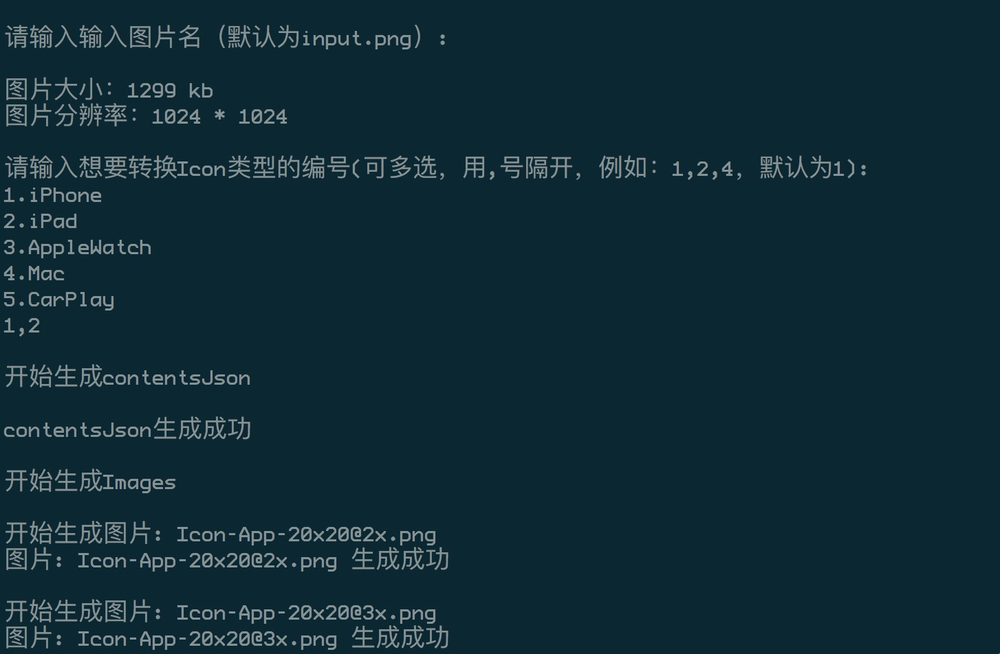

# AppIconGenerator


一键生成AppIcon的swift脚本 (Generate the swift script for AppIcon)

## Requirements

- swift4.0

## Features

- 一键生成AppIcon
- 支持iphone、ipad、Mac、AppleWatch和CarPlay

## Usage

进入Resource文件夹下，执行GenerationAppIcon.swift

```shell
cd Resource
swift GenerationAppIcon.swift
```



## License

GenerationAppIcon  [MIT license](LICENSE).

